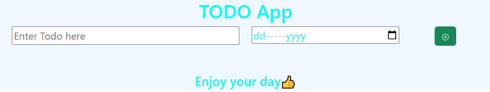
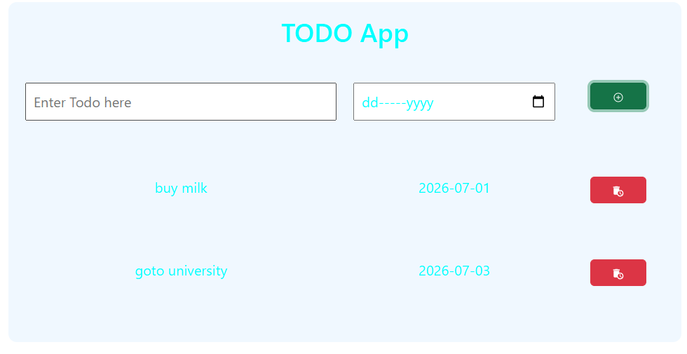

# React Todo App 🚀

A simple and responsive Todo application built with React JS.  
This project allows users to add and delete todo tasks with a clean user interface.

## 📸 Previews





## 🔗 Live Demo

https://KG-SE.github.io/react-todo-app/

## 📌 Features

- Add new todo items
- Delete todo items
- Manage application state using Context API
- State management with useReducer
- Component-based architecture
- Responsive UI using Bootstrap

## 🛠️ Technologies Used

- HTML5
- CSS3
- JavaScript (ES6)
- React JS
- Context API
- useReducer
- Bootstrap
- React Icons
- Vite

  ## 📂 Project Structure

```bash
react-todo-app
│
├──src
│   │
│   ├──components
│   │      ├── Heading.jsx
│   │      ├── AddTodo.jsx
│   │      ├── TodoItem.jsx
│   │      ├── TodoItems.jsx
│   │      └── WelcomeMsg.jsx
│   │      └── WelcomeMsg.module.css
│   │      └── store
│   │             └──TodoItemsContext.jsx
│   │
│   └──App.jsx
│   └──main.jsx
│   └──App.css
│
├──screenshots
│    │
│    ├──home.png
│    ├──todo-added.png
│

```

💡 This project helped me improve my react concepts.

## 👨‍💻 Author

**Kashan Ghori**  
🔗 https://github.com/KG-SE

---

## 🤝 Connect with Me

Feel free to connect with me on LinkedIn and check out my projects!

---

⭐ If you like this project, don't forget to star the repository!
